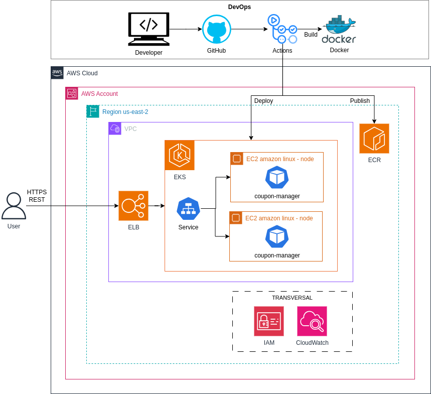

# coupon-manager
 **Ejercicio práctico para Mercado Libre:**
 Este proyecto es una API Rest creada y estructurada para ser fácil de extender y de ejecutar. Su principal función consiste en consultar productos y hacer operaciones aritmeticas en referencia a los productos consultados. La implementación usa el Framework Spring Boot, apache Maven para la gestión de dependencias y Swagger para la documentación. Se encuentra desplegada de Amazon Web Services (AWS) y cuenta con integración continua y automatizada en un repositorio remoto.
---

## Índice

1. [Acerca del Proyecto](#acerca-del-proyecto)
2. [Tecnologías](#tecnologías)
3. [Instalación](#instalación)
4. [Ejecución de servicios](#ejecución-de-servicios)
5. [Swagger API](#swagger-api)
6. [Amazon Web Services](#amazon-web-services)
   - 6.1 [Diagrama de Arquitectura en AWS](#diagrama-de-arquitectura-en-aws)
7. [Licencia](#licencia)

---

## Acerca del Proyecto

Este proyecto es una API RESTful para gestionar una consultar los ítems relacionados a los artículos que un usuario puede adquirir de manera gratuita a partir de un cupón en línea, permitiendo realizar operaciones de consulta y calcular montos sobre productos. Está diseñada para ser, utilizando tecnologías modernas y prácticas recomendadas en la industria del desarrollo de software

---

## Tecnologías

Las tecnologías principales utilizadas en este proyecto incluyen:

- **Backend**:
    - [Spring Framework](https://spring.io/) 
    - [Swagger](https://swagger.io/) 

- **Servicios en la Nube**:
    - [AWS EKS](https://aws.amazon.com/es/eks/)
    - [AWS ECR](https://aws.amazon.com/es/ecr/)
    - [AWS IAM](https://aws.amazon.com/es/iam/)
    - [AWS CloudWatch](https://aws.amazon.com/es/cloudwatch/)

---

## Instalación

Sigue estos pasos para instalar y ejecutar el proyecto en tu entorno local:

1. Instalar las herramientas necesarias
   Antes de comenzar, asegúrate de tener instaladas las siguientes herramientas:

   - Git: Necesario para clonar el repositorio de GitHub. 
     - [Descargar Git](https://git-scm.com/)
   - Java: Necesitas tener una versión compatible de Java instalada (Java 21 o superior). 
     - [Descargar Java](https://www.oracle.com/java/technologies/downloads/#java11?er=221886).
   - Maven: Maven es el sistema de construcción más común para proyectos de Spring Boot. También puedes usar un IDE como IntelliJ IDEA o Eclipse que lo gestione automáticamente.
     - [Descargar Maven](https://maven.apache.org/).
   - IDE: Es recomendable usar un entorno de desarrollo como IntelliJ IDEA, Eclipse.
     - [Descargar IntelliJ IDEA](https://www.jetbrains.com/es-es/idea/download).
     - [Descargar Eclipse](https://www.jetbrains.com/es-es/idea/download).
     

2. Descargar fuentes desde GitHub en el siguiente enlace --> [Descargar fuentes de proyecto](https://github.com/StickPaez/coupon-manager)


3. Abrir el proyecto con tu IDE:
   - **Si tienes Intellij IDEA**
      - Abre IntelliJ IDEA.
      - En la pantalla de inicio, haz clic en Open (Abrir).
      - Navega hasta la carpeta donde tienes el proyecto de Spring Boot y selecciona la carpeta raíz del proyecto.
      - Haz clic en OK.
   - **Si tienes Eclipse**
     - Abre Eclipse.
     - En la barra de menú, ve a File > Open Projects from File System....
     - En la ventana que se abre, haz clic en Directory.
     - Navega hasta la carpeta donde está ubicado tu proyecto de Spring Boot.
     - Selecciona la carpeta raíz del proyecto y haz clic en Finish.

## Ejecución de servicios
### Instrucciones para ejecutar el servicio "/v1/coupon"

**Descripción**  
Este servicio permite calcular qué productos se deben adquirir para optimizar el uso de un cupón, maximizando tanto su valor como la cantidad de productos, basándose en los identificadores de los artículos (IDs) y el monto del cupón.

### Método HTTP **POST**`/api/v1/coupon`

### Cuerpo de la solicitud (**CouponRequest**)
La solicitud debe incluir un cuerpo en formato JSON que contenga dos parámetros:

- **item_ids**: Un mapa (o diccionario) que contiene los identificadores de los productos como claves, y los precios de los productos como valores (en tipo float).
- **amount**: La cantidad total disponible para gastar en los productos.

Formato de **CouponRequest:**

```json
{
  "item_ids": {
    "item1": 12.99,
    "item2": 5.49,
    "item3": 7.99
  },
  "amount": 20.00
}
```

### Ejemplo de uso

Puedes hacer una solicitud a este servicio utilizando el siguiente comando `curl`:

```bash
curl --location --request POST 'http://a305bac8e44cb43a9918502d8a19b3fa-133058759.us-east-2.elb.amazonaws.com:8080/api/v1/coupon' \
--header 'Content-Type: application/json' \
--data '{
    "item_ids": {
    "item1": 12.99,
    "item2": 5.49,
    "item3": 7.99,
    "item4": 12.99,
    "item5": 2.49,
    "item6": 6.99
},
  "amount": 20.00
}'
```

### Respuesta

Si la solicitud se procesa correctamente, la respuesta será un JSON con una lista de los identificadores de los productos que deben comprarse dentro del monto disponible.

**Respuesta exitosa (HTTP 200 OK):**

```json
[
  "item5",
  "item2",
  "item6"
]
```

### Respuesta con error (HTTP 500 Internal Server Error)
En caso de error al procesar la solicitud, el servicio responderá con un código de estado 500 INTERNAL SERVER ERROR. La respuesta será sin cuerpo, sin embargo quedará trazabilidad de errores en el log del proyecto.

### Descripción de la lógica del servicio
El servicio recibe una lista de productos junto con un monto disponible. Internamente, el servicio calcula qué productos se pueden comprar dentro del monto proporcionado y devuelve una lista con los IDs de esos productos. La lógica busca maximizar el uso del monto disponible, seleccionando productos cuya suma de precios no exceda el monto dado.


## Instrucciones para ejecutar el servicio "/v2/coupon"

**Descripción**  
Este servicio permite calcular qué productos se deben adquirir para optimizar el uso de un cupón, maximizando tanto su valor como la cantidad de productos, basándose en los identificadores de los artículos (IDs) y el monto del cupón. Adicional a ello es capaz de traer la suma total de los artículos retornados.

### Método HTTP **POST**`/api/v2/coupon`

### Cuerpo de la solicitud (**CouponRequest**)
La solicitud debe incluir un cuerpo en formato JSON que contenga dos parámetros:

- **item_ids**: item_ids: Lista de identificadores de los artículos que se desean comprar. Cada identificador es una cadena (String).
- **amount**:  El monto del cupón (debe ser un valor numérico, tipo Float)

Formato de **CouponRequest:**

```json
{
  "item_ids": [
    "item_id_1",
    "item_id_2",
    "item_id_3"],
  "amount": 100.0
}
```

### Ejemplo de uso

Puedes hacer una solicitud a este servicio utilizando el siguiente comando `curl`:
```bash
curl --location 'http://a305bac8e44cb43a9918502d8a19b3fa-133058759.us-east-2.elb.amazonaws.com:8080/api/v2/coupon' \
--header 'Content-Type: application/json' \
--data '{
  "item_ids": [
    "MCO1492576175",
    "MCO1424694419",
    "MCO2732711358",
    "MLA811601010",
    "MLA1932055830",
    "MLA1441966743",
    "MLA1911250364",
    "MLA1889234882",
    "MLA1907296986",
    "MLA1401603057"
],
"amount": 3000000.00
}'
```

### Respuesta

Si la solicitud se procesa correctamente, la respuesta será un JSON con una lista de los identificadores de los productos que deben comprarse dentro del monto disponible, también se podrá observar la suma total del valor de los artículos a comprar.

**Respuesta exitosa (HTTP 200 OK):**

```json
{
  "total": 2127177.0,
  "item_ids": [
    "MLA811601010",
    "MLA1907296986",
    "MCO2732711358",
    "MLA1911250364",
    "MLA1889234882",
    "MCO1492576175",
    "MLA1401603057",
    "MLA1441966743",
    "MLA1932055830"
  ]
}
```


### Respuesta de Error (HTTP 404 Not Found))
Si el monto no es suficiente para adquirir por lo menos un artículo, el servicio responderá con un código de estado 404 Not Found. La respuesta será sin cuerpo, ya que solo indica que no se pueden adquirir artículos.

### Respuesta con error (HTTP 500 Internal Server Error)
En caso de error al procesar la solicitud, el servicio responderá con un código de estado 500 INTERNAL SERVER ERROR. La respuesta será sin cuerpo, sin embargo quedará trazabilidad de errores en los log del proyecto..

### Descripción de la lógica del servicio
El servicio recibe una lista de item IDs junto con un monto disponible. Internamente, el servicio consulta los precios de cada item id y calcula qué productos se pueden comprar dentro del monto proporcionado, retornando una lista con los IDs de esos productos. La lógica busca maximizar el uso del monto disponible, seleccionando productos cuya suma de precios no exceda el monto dado y calcular el monto total de los productos retornados.


## Swagger API
Generación automática de documentación de la API en el siguiente enlace:
- [Documentación Swagger](http://a305bac8e44cb43a9918502d8a19b3fa-133058759.us-east-2.elb.amazonaws.com:8080/swagger-ui/index.html#/) 

## Amazon Web Services
La arquitectura propuesta está compuesta de dos bloques principales, el primero un proceso de devops donde la columna vertebral es GitHub sirviendo como repositorio del código y a su vez como herramienta de Cicd a través de GitHub actions, por otra parte el bloque de AWS está pensado como una solución de Kubernetes que me permita tener despliegues de manera ágil y una atención a la demanda más rápida ganando características adicionales como disponibilidad, escalabilidad y flexibilidad.

## Diagrama de Arquitectura en AWS


## Licencia

Este proyecto está bajo la Licencia Apache 2.0 - consulta el archivo [LICENSE](https://www.apache.org/licenses/LICENSE-2.0) para más detalles.
